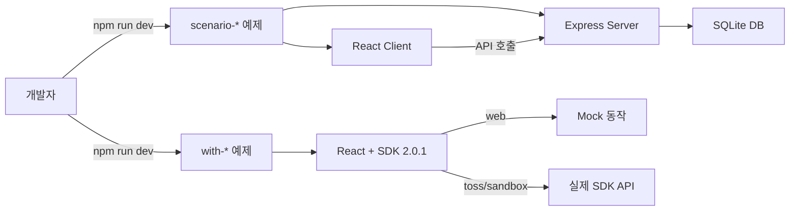

# AppsInToss Examples (Robin Edition)

[](https://developers-apps-in-toss.toss.im)
[](./LICENSE)
[](./)
[](./CONTRIBUTING.md)

SDK 2.0.1 기반 WebView 예제 모음 — 프로덕션 품질

[English](./README.en.md) | [Contributing](./CONTRIBUTING.md) | [Quick Start](./docs/quickstart.md)

## 왜 이 프로젝트인가?

[공식 예제](https://github.com/toss/apps-in-toss-examples)는 SDK 1.5~1.6 기반으로 현재 API와 차이가 있습니다.

| | 공식 예제 | Robin 예제 |
|---|----------|-----------|
| SDK | 1.5~1.6 | **2.0.1** |
| React | 18.x | **19.2.3** |
| 빌드 | granite build | **ait build** |
| 에러 처리 | 기본 | **리트라이 + 백오프** |
| 서버 | 없음 | **Express + SQLite** |
| 시나리오 | 없음 | **6개 풀스택** |

## 아키텍처



## 기술 스택
- `@apps-in-toss/web-framework` 2.0.1
- React 19.2.3 + TypeScript 5.x
- Tailwind CSS 4.x
- Zustand 5.x (상태 관리)
- `ait build` (빌드)

## 예제 목록

### ⭐ 프로덕션 검증 (dujjonku 기반)
| 예제 | 설명 | SDK API |
|------|------|---------|
| [with-env-detection](./with-env-detection/) | 실행 환경 감지 (web/toss/sandbox) | `getOperationalEnvironment()` |
| [with-rewarded-ad](./with-rewarded-ad/) | 보상형 광고 (load → show → reward) | `loadFullScreenAd()`, `showFullScreenAd()` |
| [with-interstitial-ad](./with-interstitial-ad/) | 전면 광고 | `loadFullScreenAd()`, `showFullScreenAd()` |
| [with-banner-ad](./with-banner-ad/) | 배너 광고 (TossAds v2) | `TossAds.initialize()`, `TossAds.attachBanner()` |
| [with-share-reward](./with-share-reward/) | 공유 바이럴 리워드 | `contactsViral()` |

### 📄 SDK 기능 예제
| 예제 | 설명 | SDK API |
|------|------|---------|
| [with-app-login](./with-app-login/) | 토스 로그인 | `appLogin()` |
| [with-storage](./with-storage/) | 네이티브 스토리지 | `Storage.*` |
| [with-in-app-purchase](./with-in-app-purchase/) | 인앱 결제 | `getProductItemList()`, `createOneTimePurchaseOrder()` |
| [with-share-link](./with-share-link/) | 딥링크 공유 | `getTossShareLink()` |
| [with-contacts-viral](./with-contacts-viral/) | 연락처 바이럴 | `contactsViral()` |
| [with-clipboard-text](./with-clipboard-text/) | 클립보드 | `setClipboardText()`, `getClipboardText()` |
| [with-haptic-feedback](./with-haptic-feedback/) | 햅틱 피드백 | `generateHapticFeedback()` |
| [with-platform-os](./with-platform-os/) | 플랫폼 감지 | `getPlatformOS()` |
| [with-network-status](./with-network-status/) | 네트워크 상태 | `getNetworkStatus()` |
| [with-locale](./with-locale/) | 언어/지역 설정 | `getLocale()` |
| [with-location-once](./with-location-once/) | 위치 (1회) | `getCurrentLocation()` |
| [with-location-tracking](./with-location-tracking/) | 위치 추적 | `startUpdateLocation()` |
| [with-camera](./with-camera/) | 카메라 촬영 | `openCamera()` |
| [with-album-photos](./with-album-photos/) | 앨범 사진 | `fetchAlbumPhotos()` |

### 🆕 신규
| 예제 | 설명 | SDK API |
|------|------|---------|
| [with-navigation-bar](./with-navigation-bar/) | 네비게이션바 액세서리 버튼 | `partner.addAccessoryButton()`, `tdsEvent.addEventListener()` |
| [with-back-event](./with-back-event/) | 뒤로가기 이벤트 | `useBackEvent()` |
| [with-permission](./with-permission/) | 권한 요청 | `getPermission()`, `openPermissionDialog()` |
| [with-push-notification](./with-push-notification/) | 푸시 알림 | Server-side REST API |

### 🎯 풀스택 시나리오 (Stripe Samples 모델)
| 예제 | 설명 | 조합 SDK API |
|------|------|-------------|
| [scenario-attendance-reward](./scenario-attendance-reward/) | 출석 체크 + 보상형 광고 + 캘린더 | `loadFullScreenAd`, `Storage` |
| [scenario-lottery-reward](./scenario-lottery-reward/) | 복권 뽑기 + 광고 + 프로모션 리워드 | `loadFullScreenAd`, `executePromotion` |
| [scenario-mission-system](./scenario-mission-system/) | 미션 + 진행도 + 보상 수령 | `Storage`, `executePromotion` |
| [scenario-share-viral](./scenario-share-viral/) | 공유 바이럴 + 일일 제한 + 리워드 | `contactsViral`, `Storage` |
| [scenario-milestone-withdraw](./scenario-milestone-withdraw/) | 마일스톤 + 포인트 출금 | `Storage`, `executePromotion` |
| [scenario-onboarding-coach](./scenario-onboarding-coach/) | 온보딩 + 코치마크 오버레이 | `Storage`, `getOperationalEnvironment` |

## 빠른 시작

```bash
# 단일 기능 예제
cd with-{feature}
npm install
npm run dev

# 풀스택 시나리오
cd scenario-{name}
npm run install:all
npm run dev
```

## 새 예제 만들기

```bash
cp -r _template with-my-feature
# package.json name 수정
# granite.config.ts appName 수정
# src/hooks/useMyFeature.ts 작성
# src/App.tsx 수정
```

## 공통 패턴

모든 예제는 동일한 패턴을 따릅니다:

- **환경 감지**: `getOperationalEnvironment()` → web/toss/sandbox 분기
- **Mock 동작**: 웹 브라우저에서도 동작하는 mock 제공
- **이벤트 로그**: Zustand 기반 실시간 SDK 이벤트 로깅
- **DemoLayout**: 3영역 UI (Header + Status + Action + Event Log)
- **cleanup 패턴**: useEffect cleanup으로 메모리 누수 방지
- **isSupported 체크**: 모든 SDK API 호출 전 지원 여부 확인

## 참고

- [공식 SDK 문서](https://developers-apps-in-toss.toss.im/llms.txt)
- [공식 예제 (SDK 1.x)](https://github.com/toss/apps-in-toss-examples)
- [문제 해결 가이드](./docs/troubleshooting.md)
